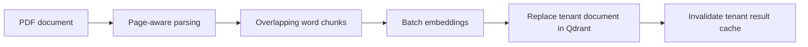
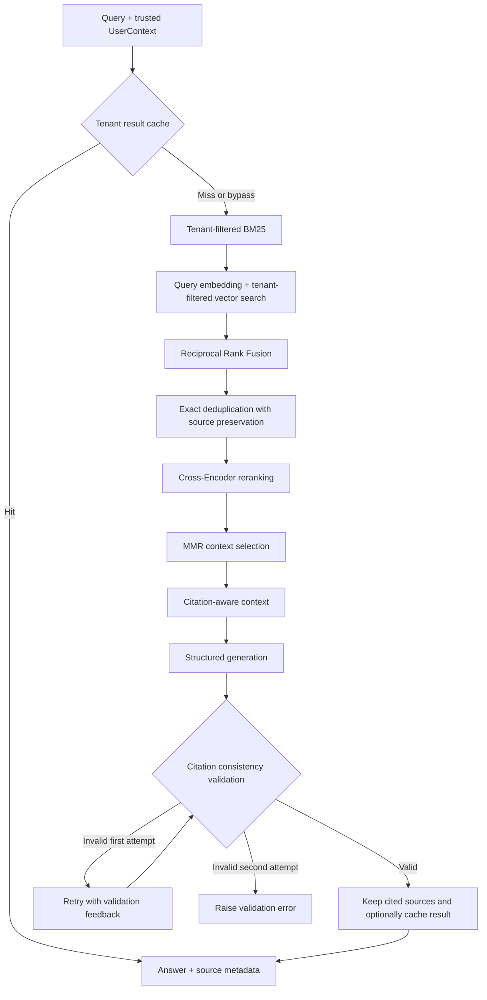

# Enterprise RAG Platform

A modular, multi-tenant **Retrieval-Augmented Generation (RAG)** project for answering questions over enterprise PDF documents with traceable sources.

The project implements the full path from document ingestion to citation-aware answers: **PDF parsing → chunking → embeddings → hybrid retrieval → reranking → context selection → generation → validation**. It also includes JWT authentication utilities, tenant-scoped retrieval, Redis caching, background ingestion, and separate retrieval and generation evaluation workflows.

> **Project status:** Active development. The core pipelines and evaluation tooling are implemented as Python modules and runnable scripts. A production HTTP API, deployment packaging, and observability remain planned work.

## Contents

- [Project purpose](#project-purpose)
- [Architecture](#architecture)
- [Implemented engineering work](#implemented-engineering-work)
- [Technology stack](#technology-stack)
- [Project structure](#project-structure)
- [Local setup](#local-setup)
- [Usage](#usage)
- [Evaluation and recorded results](#evaluation-and-recorded-results)
- [Current limitations](#current-limitations)
- [Roadmap](#roadmap)

## Project purpose

Enterprise document search requires more than retrieving a few similar passages. Exact policy terms can be missed by semantic search, duplicate content can consume the context window, generated answers need inspectable evidence, and documents belonging to different organizations must remain isolated.

This project develops those concerns as explicit, independently inspectable components. The implementation focuses on four questions:

1. **Retrieval quality:** Can lexical and semantic search find the right evidence together?
2. **Context quality:** Can reranking and diversity selection reduce irrelevant or repetitive evidence?
3. **Traceability:** Can answers reference the document, page, and chunk behind their sources?
4. **Isolation and reliability:** Can tenant boundaries, cache invalidation, background retries, and evaluations remain consistent across the pipeline?

## Architecture

### Document ingestion



Each chunk stores `tenant_id`, `document_id`, `filename`, `page`, `chunk_id`, and `text`. Background ingestion uses Celery with Redis; a separate Redis job store tracks queued, processing, retrying, completed, and failed states.

### Question answering



The retrieval branches run sequentially in the current implementation. Both use the tenant identifier supplied through the user context before their results enter rank fusion.

## Implemented engineering work

### 1. Document ingestion and re-ingestion

The ingestion pipeline extracts text page by page with `pypdf`, creates overlapping chunks, requests embeddings in a batch, and stores the resulting vectors and metadata in Qdrant.

- **Page-level provenance:** Each chunk retains its original PDF page.
- **Configurable chunking:** Defaults are 40 words per chunk with an 8-word overlap. These are word counts, not token counts.
- **Stable point identifiers:** UUIDv5 IDs derive from `tenant_id:document_id:chunk_id`.
- **Document replacement:** Re-ingestion removes the previous chunks for the same tenant and document before inserting the new version, preventing obsolete chunks from remaining after a successful replacement.
- **Cache freshness:** After insertion, cached RAG results for that tenant are invalidated.

Implementation: [`src/ingestion/`](src/ingestion/) and [`src/vector_store/qdrant_store.py`](src/vector_store/qdrant_store.py).

### 2. Hybrid retrieval and rank fusion

BM25 retrieves lexical matches such as identifiers and technical terms; vector search retrieves semantically related passages. **Reciprocal Rank Fusion (RRF)** combines their positions instead of adding raw scores from incompatible scoring systems.

For a candidate appearing in either result list:

```text
RRF score = sum(1 / (k + rank))
Default k = 60
```

The fused candidate records retain the individual BM25 and vector ranks and scores, making each branch's contribution inspectable.

Implementation: [`src/retrieval/bm25_retriever.py`](src/retrieval/bm25_retriever.py) and [`src/retrieval/hybrid_retriever.py`](src/retrieval/hybrid_retriever.py).

### 3. Reranking, deduplication, and context diversity

The context selector refines the candidate pool in three steps:

1. **Deduplicate:** Normalize case and whitespace, merge identical content, and preserve every distinct source record.
2. **Rerank:** Use `cross-encoder/ms-marco-MiniLM-L6-v2` to score query–passage pairs together.
3. **Diversify:** Use Maximal Marginal Relevance (MMR) to balance normalized reranker relevance against similarity to passages already selected.

The default `lambda_value=0.5` weights relevance and redundancy equally. Candidate embeddings for MMR are generated in a fresh batch. The default pipeline retrieves up to five results per branch, keeps five fused candidates before deduplication, and selects up to three final contexts.

Implementation: [`src/retrieval/context_selector.py`](src/retrieval/context_selector.py), [`deduplicator.py`](src/retrieval/deduplicator.py), [`reranker.py`](src/retrieval/reranker.py), and [`mmr.py`](src/retrieval/mmr.py).

### 4. Grounded generation and source traceability

Selected contexts are formatted into numbered `[SOURCE n]` blocks with document provenance. Generation uses the OpenAI Responses API and a Pydantic schema:

```python
class GeneratedAnswer(BaseModel):
    answer: str
    answered: bool
    citation_ids: list[int]
```

The generator is instructed to answer from the supplied evidence and place inline references such as `[1]` after supported claims. Before returning a result, validation checks that:

- factual answers contain at least one inline citation;
- inline citation IDs match the declared `citation_ids`;
- referenced IDs exist in the supplied context;
- abstentions use the prescribed message and contain no citations.

A failed validation triggers one additional generation attempt with the previous output and specific error feedback. If both attempts fail validation, the generator raises `ValueError`. The final response includes only the source groups actually cited in the answer.

When the supplied evidence is insufficient, the prescribed response is:

```text
I don't have enough information in the provided sources to answer this question.
```

Citation validation checks formatting and ID consistency; it does not establish that a source semantically supports every claim. An empty retrieved context currently raises an error rather than returning this abstention automatically.

Implementation: [`src/generation/generator.py`](src/generation/generator.py), [`src/citations/`](src/citations/), and [`src/rag/pipeline.py`](src/rag/pipeline.py).

### 5. Authentication and tenant isolation

JWT utilities issue and validate HS256 access tokens containing `sub`, `tenant_id`, `role`, `iat`, and `exp`. Validated claims become a typed `UserContext`; roles are `admin` and `employee`. The authorization helper allows document uploads for admins.

Both BM25 and vector retrieval filter by tenant before fusion, reranking, and generation. Result cache keys also include the tenant so cached responses cannot bypass the retrieval boundary.

The sample policies demonstrate the same question under two organizations:

| Tenant | Question | Source policy |
|---|---|---|
| ACME | What is the remote work allowance? | 500 USD annually |
| GLOBEX | What is the remote work allowance? | 2000 USD annually |

The library accepts a `UserContext` directly. A future API must derive that context from a validated token and enforce authorization before invoking ingestion; those checks are not automatically performed by `run_rag()` or `ingest_document()`.

Implementation: [`src/auth/`](src/auth/) and [`evaluation/tests/test_tenant_isolation.py`](evaluation/tests/test_tenant_isolation.py).

### 6. Redis caching and background reliability

| Layer | Identity / purpose | Default TTL |
|---|---|---|
| Query embedding cache | `embedding:<model>:<sha256(text)>` | 3,600 seconds |
| RAG result cache | Tenant + query + generation model + retrieval limits + MMR weight | 1,800 seconds |
| Job store | `job:<job_id>` with status and error information | No TTL configured |

The query embedding cache is shared across tenants because its key identifies the same text and embedding model. Batch embeddings used for ingestion and MMR do not use this cache. Redis connection failures during cache reads or writes are logged and allow the pipeline to continue; failed invalidation is also logged and skipped.

Celery ingestion tasks retry selected connection, timeout, rate-limit, and server errors with exponential backoff and jitter. They permit three retries after the initial attempt. Missing files and other non-retryable errors mark the job as failed immediately.

Implementation: [`src/cache/`](src/cache/), [`src/jobs/job_store.py`](src/jobs/job_store.py), and [`src/workers/celery_app.py`](src/workers/celery_app.py).

## Technology stack

| Responsibility | Technology |
|---|---|
| Application code | Python, asyncio |
| Generation and embeddings | OpenAI; `text-embedding-3-small` embeddings |
| Vector storage | Qdrant, cosine similarity, 1,536-dimensional vectors |
| Lexical search and fusion | `rank-bm25`, custom RRF |
| Reranking and diversity | Sentence Transformers CrossEncoder, NumPy, custom MMR |
| Typed output and identity | Pydantic, PyJWT |
| PDF extraction | pypdf |
| Cache, broker, and job metadata | Redis |
| Background processing | Celery |
| Validation tooling | unittest, JSON evaluation datasets and reports |

## Project structure

```text
enterprise-rag/
├── src/
│   ├── auth/           # JWT utilities, roles, user context, authorization
│   ├── cache/          # Embedding/result caches and tenant invalidation
│   ├── citations/      # Numbered evidence and source metadata
│   ├── generation/     # Structured answers, validation, targeted retry
│   ├── ingestion/      # PDF parsing, chunking, embeddings, ingestion
│   ├── jobs/           # Redis-backed job status
│   ├── rag/            # End-to-end question answering orchestration
│   ├── retrieval/      # BM25, RRF, deduplication, reranking, MMR
│   ├── vector_store/   # Qdrant collection, storage, filters, search
│   └── workers/        # Celery ingestion task and retry policy
├── data/               # Sample policy, handbook, and support PDFs
├── experiments/        # Incremental development and inspection scripts
├── evaluation/
│   ├── tests/          # Unit tests and tenant-isolation integration tests
│   ├── results/        # Recorded JSON evaluation reports
│   └── *_runner.py     # Retrieval, ablation, and generation workflows
├── requirements.txt
└── README.md
```

The `experiments/` directory records incremental work on embeddings, retrieval, provenance, authorization, caching, retries, and ingestion. Some early scripts predate the current tenant-aware interfaces; use the entry points below for the main workflow.

## Local setup

Run commands from the repository root. Local execution requires Python, Docker (for the service examples below), and an OpenAI API key. The first reranker load may download model weights.

### 1. Install Python dependencies

```bash
python3 -m venv .venv
source .venv/bin/activate
python -m pip install -r requirements.txt
python -m pip install rank-bm25 redis celery pydantic httpx
```

The second command installs direct dependencies used in the source that are not explicitly listed in the current `requirements.txt`. The repository does not yet provide a complete dependency lockfile.

### 2. Configure environment variables

Create a local `.env` file:

```dotenv
OPENAI_API_KEY=your-openai-api-key
JWT_SECRET_KEY=your-generated-secret
GENERATION_MODEL=gpt-4.1-mini
```

Generate a JWT secret with `python -c 'import secrets; print(secrets.token_hex(32))'` and use the output as `JWT_SECRET_KEY`. The `.env` file is excluded by `.gitignore`. `GENERATION_MODEL` configures the generation evaluation runner; direct `run_rag()` calls receive their model as an argument.

### 3. Start Qdrant and Redis

These commands create local development containers with named volumes:

```bash
docker run -d --name enterprise-rag-qdrant \
  -p 127.0.0.1:6333:6333 \
  -v enterprise-rag-qdrant-data:/qdrant/storage \
  qdrant/qdrant

docker run -d --name enterprise-rag-redis \
  -p 127.0.0.1:6381:6379 \
  -v enterprise-rag-redis-data:/data \
  redis:7 redis-server --appendonly yes
```

If these containers already exist, start them with `docker start enterprise-rag-qdrant enterprise-rag-redis`.

The current source uses fixed local addresses:

| Service | Address / database |
|---|---|
| Qdrant | `http://localhost:6333`; collection `enterprise_documents` |
| Celery broker | `redis://localhost:6381/0` |
| Job store | Redis port `6381`, database `1` |
| Embedding and result caches | Redis port `6381`, database `2` |

## Usage

### Ingest the sample tenant documents

```bash
python -m experiments.tenant_ingestion
```

This indexes ACME and GLOBEX policy and handbook PDFs. Re-running it replaces the corresponding tenant/document records and invalidates their cached answers. Embedding and generation workflows make OpenAI API calls.

### Ask a question

```python
import asyncio

from src.auth.models import Role, UserContext
from src.rag.pipeline import run_rag


async def main():
    user = UserContext(
        user_id="acme-user-123",
        tenant_id="acme",
        role=Role.EMPLOYEE,
    )
    result = await run_rag(
        query="What is the remote work allowance?",
        model="gpt-4.1-mini",
        user_context=user,
        retrieval_limit=5,
        final_limit=3,
        lambda_value=0.5,
        use_cache=True,
    )
    print(result)


asyncio.run(main())
```

This local example creates a user context explicitly; an authenticated application should obtain it through `decode_access_token()`.

Illustrative response, with wording dependent on generation:

```json
{
  "answer": "Employees receive an annual home office allowance of 500 USD [1].",
  "citations": [
    {
      "citation_id": 1,
      "sources": [
        {
          "document_id": "remote-work-policy",
          "filename": "acme-policy.pdf",
          "page": 1,
          "chunk_id": "chunk-001"
        }
      ]
    }
  ]
}
```

### Run background ingestion

Start a worker in one terminal:

```bash
source .venv/bin/activate
celery -A src.workers.celery_app:celery_app worker --loglevel=info
```

Submit the example job in another terminal:

```bash
python -m experiments.test_background_ingestion
```

The script creates a job record and queues the ACME handbook as `second-document`. This also provides duplicate content for inspecting provenance-preserving deduplication. The worker must be able to access the submitted PDF path. Inspect its status with `get_job(job_id)` from `src.jobs.job_store`.

## Evaluation and recorded results

Retrieval and generation are evaluated separately so finding relevant evidence is not confused with producing a valid answer.

### Retrieval evaluation

The retrieval dataset contains **24 cases**. Metrics account for all source IDs preserved inside a deduplicated context:

- **Precision@3:** Fraction of the three context slots that match at least one relevant source.
- **Recall@3:** Fraction of relevant source IDs recovered in those contexts.
- **MRR:** Mean reciprocal rank of the first relevant context.

Recorded in [`retrieval_baseline.json`](evaluation/results/retrieval_baseline.json) on October 8, 2026 (UTC):

| Cases | Mean Precision@3 | Mean Recall@3 | MRR |
|---|---|---|---|
| 24 | 0.3611 | 1.0000 | 0.9375 |

The ablation workflow compares hybrid retrieval with deduplication, then reranking, then MMR on the same dataset. Recorded in [`ablation_results.json`](evaluation/results/ablation_results.json):

| Stage | Mean Precision@3 | Mean Recall@3 | MRR |
|---|---|---|---|
| Hybrid + deduplication | 0.3611 | 1.0000 | 0.9583 |
| + Cross-Encoder reranking | 0.3611 | 1.0000 | 0.9306 |
| + MMR | 0.3611 | 1.0000 | 0.9375 |

These results do not show a ranking improvement from reranking or MMR on this dataset. They provide a baseline for investigating candidate selection, model suitability, and diversity settings. Precision uses a fixed denominator of three; recall is reported as unavailable for cases without relevant sources and excluded from mean recall.

### Generation evaluation

The generation dataset contains **8 cases**, covering tenant-specific facts, annual leave, MFA, VPN requirements, a multi-fact question, and an unsupported question requiring abstention.

Checks verify expected and forbidden phrases, inline citation presence, cited document IDs, and abstention behavior. The runner bypasses the final result cache, records `PASS`, `FAIL`, or `ERROR` per case, and continues after individual case errors.

Recorded in [`generation_baseline.json`](evaluation/results/generation_baseline.json) on October 9, 2026, using `gpt-4.1-mini`:

| Cases | Passed | Failed | Errors | Pass rate |
|---|---|---|---|---|
| 8 | 8 | 0 | 0 | 100% |

These are saved results from a small dataset, not a production accuracy guarantee. Phrase checks and citation consistency do not measure semantic faithfulness or claim-level attribution. Re-running the workflows may produce different results and overwrites their report files.

### Run checks and evaluations

Focused unit tests for generation validation, mocked retry behavior, and generation metrics:

```bash
python -m unittest discover -s evaluation/tests -p 'test_generator_validation.py' -v
python -m unittest discover -s evaluation/tests -p 'test_generator_retry.py' -v
python -m unittest discover -s evaluation/tests -p 'test_generation_metrics.py' -v
```

The generator tests mock generation requests where needed, but import-time client initialization still requires `OPENAI_API_KEY` to be set.

After starting the services and ingesting the sample documents:

```bash
python -m unittest discover -s evaluation/tests -p 'test_retrieval_metrics.py' -v
python -m unittest discover -s evaluation/tests -p 'test_tenant_isolation.py' -v
python -m evaluation.retrieval_runner
python -m evaluation.ablation_runner
python -m evaluation.generation_runner
```

Tenant-isolation tests exercise live retrieval. Retrieval-related imports initialize the reranker and embedding client, so even metric tests require the model and Python dependencies to be available. Evaluation ground-truth chunk IDs depend on document identity and chunking settings; changes to either require reviewing the datasets.

## Current limitations

- **Application boundary:** No HTTP API or frontend is implemented. Authentication and authorization utilities must be connected to a trusted request boundary.
- **BM25 scaling:** The index is rebuilt per query from a single Qdrant scroll page of up to 100 tenant chunks; pagination and a persistent lexical index are not implemented. Empty tenant corpora also need explicit handling.
- **PDF coverage:** Extraction supports text-based PDFs. OCR for scanned documents is not implemented.
- **Replacement safety:** Re-ingestion deletes old chunks before upserting new ones. A failure between these operations can leave a document unavailable; replacement is not atomic.
- **Cache freshness:** Invalidation is best effort. If Redis is unavailable during invalidation, previous cached results can remain until expiry. Cache identity does not version the prompt, reranker, or embedding configuration.
- **Answer validation:** Citation consistency does not prove source support. Empty evidence and exhausted validation attempts surface errors for the caller to handle.
- **Operations:** Service addresses are hardcoded, dependencies are not fully pinned, and structured tracing, latency measurement, and cost tracking are pending.

## Roadmap

- [x] Page-aware PDF ingestion and overlapping chunks
- [x] Tenant-scoped vector storage and document replacement
- [x] BM25 + vector retrieval with RRF
- [x] Provenance-preserving deduplication, reranking, and MMR
- [x] Structured generation, citation validation, and targeted retry
- [x] JWT utilities and role-based upload authorization helper
- [x] Tenant-aware result caching and ingestion-triggered invalidation
- [x] Celery ingestion with job tracking and selective retries
- [x] Retrieval, ablation, and generation evaluation workflows
- [ ] Observability and tracing
- [ ] Latency, token usage, and cost measurement
- [ ] Authenticated production API
- [ ] Reproducible dependency and deployment packaging
- [ ] Persistent lexical indexing and larger-corpus evaluation
- [ ] Semantic faithfulness and adversarial evaluation
- [ ] Atomic document replacement and stronger cache versioning

The project keeps retrieval, evidence selection, generation, and validation explicit so that their behavior can be inspected and improved independently.
