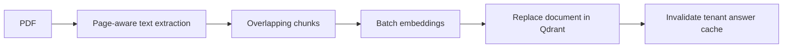
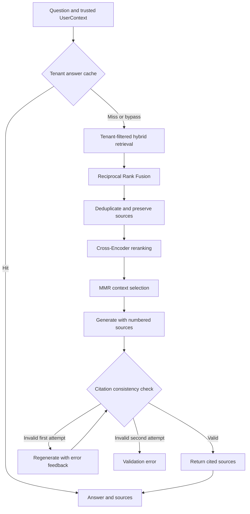

# Enterprise RAG — Multi-Tenant Document Question Answering

**Enterprise RAG** is a Python project that indexes enterprise PDF documents and generates source-backed answers while keeping each organization's documents within its own tenant boundary.

I developed document ingestion, hybrid retrieval, context selection, and answer generation as separate components, then added tenant isolation, JWT utilities, Redis caching, background ingestion with Celery, and evaluation workflows. The goal was to make it possible to inspect **which information the system can access, which evidence it uses, and how well each stage performs**.

> **Current status:** The core workflows run through Python modules and experiment scripts. An HTTP API, user interface, and production deployment package have not yet been implemented.

## Highlights

- **Multi-tenant isolation:** Tenant filters in lexical/vector retrieval and tenant-scoped result cache keys.
- **Hybrid retrieval:** BM25 + vector search fused with RRF, followed by source-preserving deduplication, reranking, and MMR.
- **Citation validation:** Structured answers, inline/source ID consistency checks, and one feedback-driven retry.
- **Background ingestion:** Page-aware PDF indexing with Celery, Redis job tracking, and selective retries.
- **Retrieval evaluation:** 24 cases; recorded mean Recall@3 of 1.0000 and MRR of 0.9375.
- **Generation evaluation:** 8/8 cases passed in the saved baseline; small-dataset results, not a general accuracy estimate.

## 1. The Problem

An organization's leave, remote work, security, and expense policies may be spread across multiple documents. Answering an employee's question requires finding the relevant passages, combining the necessary evidence, and showing where the answer came from.

When several organizations share the same infrastructure, access boundaries become part of the retrieval problem. ACME and GLOBEX may both have a document called a remote work policy, but their policies may contain different facts. The question identifies the information being requested; the user context determines which organization's documents can be searched.

I built the project around this scenario:

| User context | Question | Information in the accessible policy |
|---|---|---|
| ACME employee | What is the remote work allowance? | 500 USD annually |
| GLOBEX employee | What is the remote work allowance? | 2000 USD annually |

This distinction is carried into both retrieval filters and the result cache. The same question can therefore produce different answers grounded in the user's tenant-specific documents.

## 2. What I Implemented

| Area | Implemented behavior | Engineering purpose |
|---|---|---|
| Document ingestion | Page-aware PDF extraction, overlapping chunks, and embeddings | Turn documents into searchable evidence |
| Hybrid retrieval | BM25 and vector search combined with RRF | Use lexical matches and semantic similarity together |
| Context selection | Deduplication, Cross-Encoder reranking, and MMR | Select relevant evidence while reducing repetition |
| Source traceability | Preserve document, page, and chunk metadata | Make the evidence behind an answer inspectable |
| Answer validation | Structured output, citation consistency checks, and targeted retry | Detect inconsistent source references |
| Tenant isolation | Tenant boundaries in BM25, vector search, and result caching | Separate organizations' data |
| Identity and roles | JWT validation, typed user context, and admin authorization helper | Prepare the components needed for a trusted application boundary |
| Caching | Query embedding cache and tenant-scoped answer cache | Reduce repeated computation |
| Background processing | Celery tasks, Redis job tracking, and selective retries | Process documents outside the synchronous application path |
| Evaluation | Retrieval, ablation, and generation reports | Measure behavior and compare pipeline stages |

## 3. How the System Works

The system has two main workflows: indexing documents and answering questions over the indexed evidence.

### 3.1. Document Ingestion



Each chunk carries `tenant_id`, `document_id`, `filename`, `page`, `chunk_id`, and `text`. Retrieved text therefore keeps its document and page information throughout the answer pipeline.

The default chunking configuration is **40 words with an 8-word overlap**. These are word counts, not token counts. Pages are processed independently, so chunks do not cross page boundaries. Overlap helps reduce information loss at chunk boundaries within a page.

Qdrant point IDs are generated with UUIDv5 from `tenant_id:document_id:chunk_id`. Re-ingesting a document removes its previous chunks within the same tenant and inserts the new version. After a successful update, the tenant's cached answers are invalidated.

**Relevant code:** [`src/ingestion/pipeline.py`](src/ingestion/pipeline.py), [`chunker.py`](src/ingestion/chunker.py), and [`qdrant_store.py`](src/vector_store/qdrant_store.py).

### 3.2. Question Answering



The entry point is [`run_rag()`](src/rag/pipeline.py). It receives a query, generation model, and `UserContext`, then coordinates cache lookup, context selection, generation, and source filtering.

With the default configuration, each retrieval branch returns up to **five candidates**. RRF retains up to five fused candidates before deduplication and reranking; MMR then selects up to **three contexts** for generation. BM25 and vector retrieval currently execute sequentially.

## 4. Technical Decisions and Their Rationale

### Hybrid Retrieval and RRF

BM25 captures exact terms and identifiers; vector search captures semantic similarity across different wording. **Reciprocal Rank Fusion** combines their rank positions because the raw scores use different scales. Each list contributes `1 / (k + rank)`, with `k=60`. Individual ranks and scores remain available for inspection.

### Reranking and Context Diversity

The Cross-Encoder `cross-encoder/ms-marco-MiniLM-L6-v2` scores query–passage pairs to refine relevance. **MMR** then balances normalized relevance against similarity to already selected passages, using `lambda_value=0.5` by default. Candidate embeddings are generated in a fresh batch. Their measured impact is reported in the ablation results below.

### Source-Preserving Deduplication

Case and whitespace normalization identifies repeated text. Matching candidates are merged while distinct source records remain in `sources`, so generation receives the content once without losing document provenance. This uses normalized text equality, not semantic similarity.

### Structured Generation and Citation Validation

The Pydantic output schema contains `answer: str`, `answered: bool`, and `citation_ids: list[int]`. Validation requires factual answers to include inline references, match the declared IDs, and cite only supplied sources. Abstentions must use the prescribed message with no citations.

Invalid output triggers one retry with the previous response and specific validation errors; two invalid attempts raise an error. Only cited source groups are returned. These checks establish citation consistency, not semantic support for every claim.

### Tenant Boundaries and Identity

Tenant filtering happens inside BM25 loading and Qdrant vector retrieval, before fusion or generation. JWT utilities validate user, tenant, role, and expiration claims into `UserContext`; an authorization helper restricts uploads to admins.

`run_rag()` trusts its supplied context, and ingestion does not invoke the role helper automatically. A future API must validate tokens and enforce authorization before calling these pipelines.

### Two Cache Layers

| Cache | Key identity | Default TTL |
|---|---|---|
| Query embedding | Embedding model + SHA-256 of text | 60 minutes |
| RAG answer | Tenant + query + generation model + retrieval/context limits + MMR weight | 30 minutes |

Query embeddings are reusable across tenants for identical text and models; answers depend on the tenant's accessible documents. Batch embeddings bypass the embedding cache. Successful ingestion invalidates tenant answers. Cache connection failures allow processing to continue, but failed invalidation can leave old answers until expiry.

### Background Processing and Retry Policy

Celery handles ingestion while Redis tracks `queued`, `processing`, `retrying`, `completed`, and `failed` states. Selected connection, timeout, rate-limit, and server errors allow three retries after the initial attempt, using exponential backoff and jitter. Non-retryable errors such as missing files fail immediately.

## 5. Evaluation and Findings

I created separate datasets and reports for retrieval and generation. Finding relevant evidence and producing a valid, source-backed answer are different outcomes, so I measured them separately.

The numbers below come from reports already saved in the repository. Live evaluations were not rerun as part of this README update.

### 5.1. Retrieval: Is the Relevant Evidence Found?

The retrieval dataset contains **24 cases**. Precision@3, Recall@3, and MRR are calculated over the selected contexts, including all source IDs preserved by deduplication.

| Metric | Recorded result | Interpretation |
|---|---|---|
| Mean Precision@3 | 0.3611 | About 36% of the three context slots match a relevant source on average |
| Mean Recall@3 | 1.0000 | All labeled relevant sources were recovered in cases with relevant-source labels |
| MRR | 0.9375 | The first relevant result usually appears near the top |

Precision uses a fixed denominator of three. Recall is undefined for cases without relevant-source labels and is excluded from mean recall. High recall therefore does not mean every selected context is relevant.

**Report:** [`retrieval_baseline.json`](evaluation/results/retrieval_baseline.json), October 8, 2026 (UTC).

### 5.2. Ablation: Do Additional Stages Improve the Result?

I compared hybrid retrieval with deduplication, Cross-Encoder reranking, and MMR on the same 24 cases:

| Stage | Precision@3 | Recall@3 | MRR |
|---|---|---|---|
| Hybrid retrieval + deduplication | 0.3611 | 1.0000 | 0.9583 |
| + Cross-Encoder | 0.3611 | 1.0000 | 0.9306 |
| + MMR | 0.3611 | 1.0000 | 0.9375 |

Under these conditions, reranking and MMR did not improve the reported metrics over the hybrid baseline. This motivates further investigation of model suitability, candidate pool size, and diversity settings on a larger dataset. MMR's diversity objective has not yet been assessed with a separate diversity metric.

**Report:** [`ablation_results.json`](evaluation/results/ablation_results.json).

### 5.3. Generation: Does the Answer Contain the Expected Facts and Sources?

The generation dataset contains **eight cases**, covering tenant-specific facts, annual leave, MFA, VPN requirements, a multi-fact question, and an unsupported question requiring abstention.

Checks examine expected phrases, forbidden phrases, inline citations, expected document IDs, and abstention behavior. The runner bypasses the answer cache and records each case as `PASS`, `FAIL`, or `ERROR`.

| Generation model | Cases | PASS | FAIL | ERROR |
|---|---|---|---|---|
| `gpt-4.1-mini` | 8 | 8 | 0 | 0 |

**Report:** [`generation_baseline.json`](evaluation/results/generation_baseline.json), October 9, 2026.

This is a recorded run on a small dataset, not a general accuracy estimate. Current checks use phrase matching and citation consistency; they do not measure semantic faithfulness or support for every individual claim.

## 6. Where to Start Reviewing the Code

| Review goal | Starting point |
|---|---|
| Understand the end-to-end answer workflow | [`src/rag/pipeline.py`](src/rag/pipeline.py) |
| Follow document indexing | [`src/ingestion/pipeline.py`](src/ingestion/pipeline.py) |
| Inspect retrieval and context selection | [`src/retrieval/context_selector.py`](src/retrieval/context_selector.py) |
| Review hybrid retrieval and RRF | [`src/retrieval/hybrid_retriever.py`](src/retrieval/hybrid_retriever.py) |
| Inspect citation validation and retry | [`src/generation/generator.py`](src/generation/generator.py) |
| Check tenant filters and document replacement | [`src/vector_store/qdrant_store.py`](src/vector_store/qdrant_store.py) |
| Understand evaluation methodology | [`evaluation/retrieval_runner.py`](evaluation/retrieval_runner.py), [`generation_runner.py`](evaluation/generation_runner.py) |

```text
src/          Reusable application components
experiments/  Incremental development and inspection scripts
evaluation/   Datasets, metrics, tests, and recorded reports
data/         Sample enterprise policies and PDF documents
```

The `experiments/` directory also records development history. Some older scripts predate the current tenant-aware interfaces and may need updates. Use the entry points below for the main workflow.

## 7. Running Locally

### Technology Stack

Python · OpenAI Responses API · `text-embedding-3-small` · Qdrant · `rank-bm25` · Sentence Transformers · NumPy · Pydantic · PyJWT · pypdf · Redis · Celery · unittest

The Qdrant collection uses 1,536-dimensional vectors and cosine similarity. Service addresses are currently fixed in the source code.

### 7.1. Prepare the Environment

Run commands from the repository root. Python, Docker for the service examples below, and an OpenAI API key are required.

```bash
python3 -m venv .venv
source .venv/bin/activate
python -m pip install -r requirements.txt
```

The first Cross-Encoder load may download model weights.

Create a local `.env` file:

```dotenv
OPENAI_API_KEY=your-openai-api-key
JWT_SECRET_KEY=your-generated-secret
GENERATION_MODEL=gpt-4.1-mini
```

Generate a JWT secret with `python -c 'import secrets; print(secrets.token_hex(32))'`. The `.env` file is excluded from Git. `GENERATION_MODEL` configures the generation evaluation runner; direct `run_rag()` calls receive the model as an argument.

### 7.2. Start the Services

```bash
# Qdrant: localhost:6333
docker run -d --name enterprise-rag-qdrant \
  -p 127.0.0.1:6333:6333 \
  -v enterprise-rag-qdrant-data:/qdrant/storage \
  qdrant/qdrant

# Redis: localhost:6381
docker run -d --name enterprise-rag-redis \
  -p 127.0.0.1:6381:6379 \
  -v enterprise-rag-redis-data:/data \
  redis:7 redis-server --appendonly yes
```

If these containers already exist, use `docker start enterprise-rag-qdrant enterprise-rag-redis`. Redis database `0` is the Celery broker, `1` stores job states, and `2` stores caches.

### 7.3. Index Sample Documents and Ask a Question

```bash
python -m experiments.tenant_ingestion
```

This script indexes ACME and GLOBEX policies and handbooks. Re-running it replaces the corresponding documents. Embedding and generation steps make OpenAI API calls.

Example question-answering workflow:

```python
import asyncio
from src.auth.models import Role, UserContext
from src.rag.pipeline import run_rag

async def main():
    user = UserContext(
        user_id="acme-user-123",
        tenant_id="acme",
        role=Role.EMPLOYEE,
    )
    result = await run_rag(
        query="What is the remote work allowance?",
        model="gpt-4.1-mini",
        user_context=user,
        retrieval_limit=5,
        final_limit=3,
        lambda_value=0.5,
    )
    print(result)

asyncio.run(main())
```

This local example creates a user context directly. An authenticated application should obtain it through `decode_access_token()`.

Illustrative response format; generated wording may vary:

```json
{
  "answer": "Employees receive an annual home office allowance of 500 USD [1].",
  "citations": [
    {
      "citation_id": 1,
      "sources": [
        {
          "document_id": "remote-work-policy",
          "filename": "acme-policy.pdf",
          "page": 1,
          "chunk_id": "chunk-001"
        }
      ]
    }
  ]
}
```

### 7.4. Run Background Ingestion

Start a worker in one terminal:

```bash
celery -A src.workers.celery_app:celery_app worker --loglevel=info
```

Submit the example task from another terminal:

```bash
python -m experiments.test_background_ingestion
```

The script queues the ACME handbook as `second-document`. Indexing the same content under two document IDs also provides a way to inspect source-preserving deduplication. The worker must be able to access the PDF path. Read job status with `src.jobs.job_store.get_job(job_id)`.

### 7.5. Run Tests and Evaluations

Citation validation, mocked generation retry, and generation metric tests:

```bash
python -m unittest discover -s evaluation/tests -p 'test_generator_validation.py' -v
python -m unittest discover -s evaluation/tests -p 'test_generator_retry.py' -v
python -m unittest discover -s evaluation/tests -p 'test_generation_metrics.py' -v
```

Generation requests in the relevant tests are mocked, but client initialization at import time still requires `OPENAI_API_KEY` to be set.

After starting services and indexing the sample documents:

```bash
python -m unittest discover -s evaluation/tests -p 'test_retrieval_metrics.py' -v
python -m unittest discover -s evaluation/tests -p 'test_tenant_isolation.py' -v
python -m evaluation.retrieval_runner
python -m evaluation.ablation_runner
python -m evaluation.generation_runner
```

Tenant tests exercise live retrieval. The retrieval metric tests' import chain also initializes the embedding client and reranker. Evaluation runners overwrite their JSON reports. If chunking settings or document IDs change, review the expected source IDs in the datasets.

## 8. Current Limitations and Next Steps

The project currently provides a working engineering foundation for developing and evaluating the RAG workflow. The following areas remain before production deployment:

| Current limitation | Next step |
|---|---|
| BM25 is rebuilt per query from at most 100 tenant chunks, without pagination | Persistent lexical indexing, pagination, and explicit empty-corpus handling |
| Document replacement uses separate delete and insert operations | Atomic or versioned document replacement |
| Cache invalidation is best effort; keys do not version the full prompt and model configuration | Stronger cache versioning and invalidation |
| Citation checks establish format and ID consistency | Claim-level source support and semantic faithfulness evaluation |
| Empty context and exhausted validation attempts raise errors | Explicit API-level error and abstention contracts |
| JWT and role utilities are not connected to an HTTP boundary | Authenticated API and enforced authorization |
| PDF extraction does not include OCR | Scanned-document processing |
| Logging consists of development diagnostics | Tracing, latency, token usage, and cost measurement |
| Dependencies are not fully pinned and deployment packaging is absent | Reproducible installation and deployment configuration |

## 9. Key Engineering Takeaways

- **Retrieve evidence and evaluate answers separately.** Retrieval recall and generation checks describe different outcomes; neither alone establishes end-to-end answer quality.
- **Additional stages need measured justification.** Reranking and MMR did not improve the reported metrics over the hybrid baseline on this dataset. Broader evaluation and parameter tuning are needed before claiming a benefit.
- **Isolation must include cached responses.** Tenant-filtered retrieval protects the evidence path; tenant-scoped result keys preserve that boundary when retrieval is bypassed by a cache hit.
- **Deduplication should retain provenance.** Merging repeated text reduces redundant context while preserving the documents behind the evidence.
- **Citation consistency is only one validation layer.** Valid source IDs make answers traceable, but semantic faithfulness and claim-level support require separate evaluation.
- **Reliability includes state transitions and freshness.** Job tracking and selective retries expose ingestion failures; non-atomic document replacement and best-effort cache invalidation remain explicit improvement areas.
